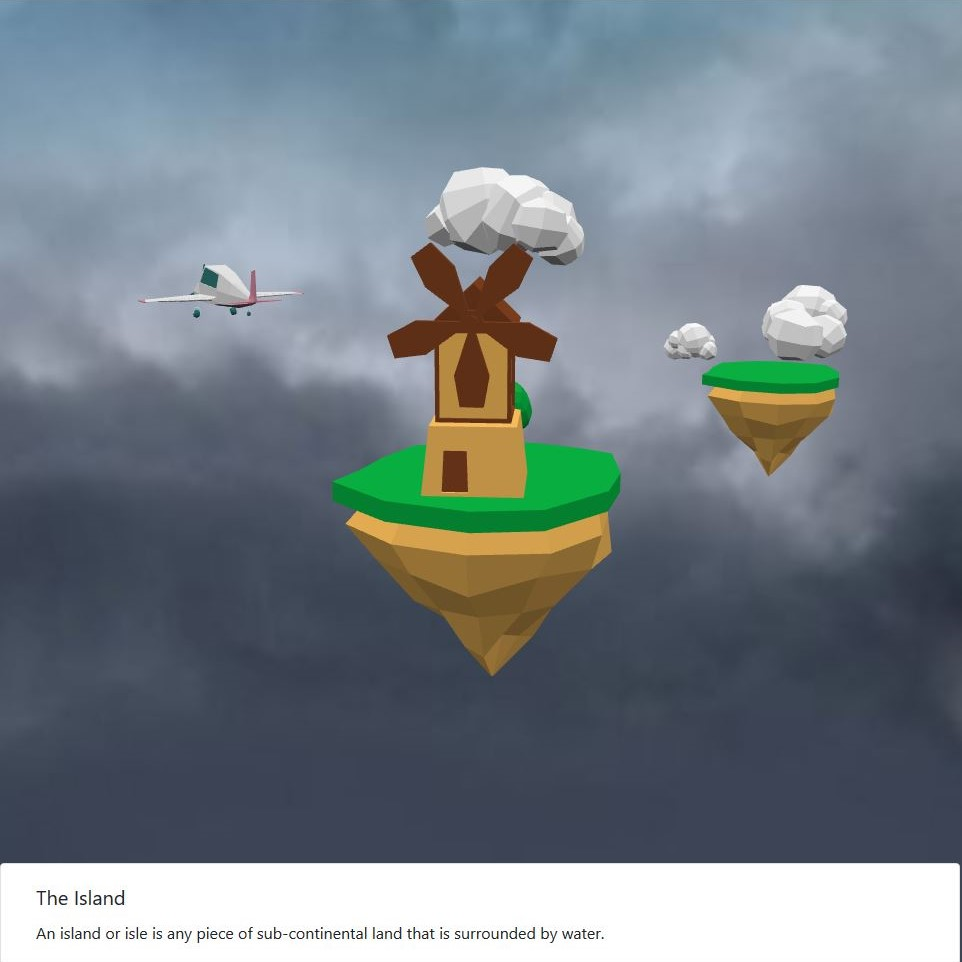

# Three Dimensional Index

- Programming language: **Javascript**
- Library: **Babylon.js**
- Integrated development environment (IDE): **Text editor**
- Intended platforms: **Web browsers**

## 1. User Guide

This user guide describes the application, its main functionalities and use case.

### 1.1 Description of the Application
The application is an index in three dimensions. Il enables the user to navigate through a 3D world with several objects. When the user clicks on an object, information about it is displayed.

### 1.2 Main Features

#### 1.2.1 Controller
The controller is the central script that manages all the interactions between the other scripts

#### 1.2.2 Hierarchy
The Hierarchy class allows to store data in a hierarchical tree.

#### 1.2.3 Dataset
The Dataset class populates the data with the information about the objects in the world.

#### 1.2.4 Camera
The Camera class creates a camera with the necessary constraints in terms of angles, zoom in/out and moves.

#### 1.2.5 World
The World class positions the lights, the locators, loads the assets and implements the user interactions on objects.

#### 1.3.6 Interface
The Interface class update the information on the interface over the 3D canvas.

### 1.3 Demo

A demo of the application is available on the following link:
http://www.tommelani.com/projects/threedimensionalindex/

